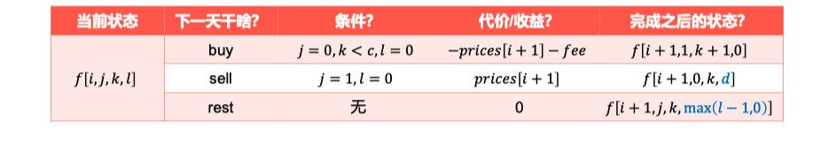

# Week07

| 序号 | Leetcode                                                     | 难度 | 分类 | 代码                                                         |
| ---- | ------------------------------------------------------------ | ---- | ---- | ------------------------------------------------------------ |
| 1    | [5. 最长回文子串](https://leetcode.cn/problems/longest-palindromic-substring/) | 中等 | 动规 | [code](https://github.com/zhj6422/LeetcodeHomework/blob/main/week07/5.%20%E6%9C%80%E9%95%BF%E5%9B%9E%E6%96%87%E5%AD%90%E4%B8%B2.java) |
| 2    | [122. 买卖股票的最佳时机 II](https://leetcode.cn/problems/best-time-to-buy-and-sell-stock-ii/)（多次买卖） | 中等 | 动规 | [code](https://github.com/zhj6422/LeetcodeHomework/blob/main/week07/122.%20%E4%B9%B0%E5%8D%96%E8%82%A1%E7%A5%A8%E7%9A%84%E6%9C%80%E4%BD%B3%E6%97%B6%E6%9C%BA%20II.java) |
| 3    | [188. 买卖股票的最佳时机 IV](https://leetcode.cn/problems/best-time-to-buy-and-sell-stock-iv/)（最多k次买卖） | 困难 | 动规 |                                                              |
| 4    | [309. 最佳买卖股票时机含冷冻期](https://leetcode.cn/problems/best-time-to-buy-and-sell-stock-with-cooldown/) | 中等 | 动规 |                                                              |
| 5    | [121. 买卖股票的最佳时机](https://leetcode.cn/problems/best-time-to-buy-and-sell-stock/)（一次买卖） | 简单 | 动规 |                                                              |
| 6    | [123. 买卖股票的最佳时机 III](https://leetcode.cn/problems/best-time-to-buy-and-sell-stock-iii/)（最多两次买卖） | 困难 | 动规 |                                                              |
| 7    | [714. 买卖股票的最佳时机含手续费](https://leetcode.cn/problems/best-time-to-buy-and-sell-stock-with-transaction-fee/) | 中等 | 动规 |                                                              |
| 8    |                                                              |      |      |                                                              |
| 9    |                                                              |      |      |                                                              |
| 10   |                                                              |      |      |                                                              |

## 动规思路

- 从当前点往后走

